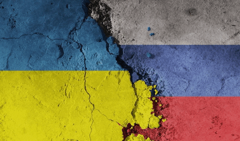

# Welcome to Wolrd Events Analysis April 2022

This page illustrates a set of analysis as well as visualizations of the current world events happening in April 2022, specifically focusing on analyzing events in Ukraine. 

## Problem statement
This page illustrates a set of visualizations and plots to illustrate some
of the current World events, specifically focusing on analyzing current events in Ukraine. 

With limited resources about current events in Ukraine, we use the technologies including OCR, Named Entity Recognition, GeoParsing and the visualization to profoundly analyze the given data. After extracting the text from images, we generate 10 entities by Named Entity Recognition as well as dynamic maps by GeoParsing, which displays a comprehensive understanding about the current world event. 

This may include maps of the specific locations of interest,
illustrations of international relations, etc. You will explore and analyze the entities
appearing in the news, as well as their relation. Additionally, you will compare and
contrast various news sources and identify the key similarities and differences between
them.
This time, you take the role of a strategic analyst, and your task is to analyze the current
events in Ukraine. It is a war time; the internet is down, and you don’t have the proper
access to the news sources. However, you have been provided the screenshots of the
news coverage by a foreign intelligence agency. Your superiors are asking you to extract
the data from the images and to analyze the events as they unfold day by day. You are one
of the few people who can do it successfully. World peace depends on you.

## Data processing

The objective of this assignment is to build upon the great analytic work and data science
work you did exploring semantic forensics and scientific literature. This time, we will
shift our focus from scientific literature to current events. You will use the technologies
such as OCR, Named Entity Recognition (NER), GeoParsing and the visualization techniques to
explore and interact with your data.
1. OCR was first used to extra text out of 
2. NER was then used to detect the following entities:
- PERSON: People, including fictional.
- NORP: Nationalities or religious or political groups.
- FAC: Buildings, airports, highways, bridges, etc.
- ORG: Companies, agencies, institutions, etc.
- GPE: Countries, cities, states.
- LOC: Non-GPE locations, mountain ranges, bodies of water.
- PRODUCT: Objects, vehicles, foods, etc. (Not services.)
- EVENT: Named hurricanes, battles, wars, sports events, etc.
- DATE: Absolute or relative dates or periods.
- TIME: Times smaller than a day.
4. GeoParsing...

## Findings

### Contributors
Team DHKMWY - [Duyen Nguyen](https://github.com/duyen21), Harvey Fu, Kaiyin Chan, My Ta, Weixing Nie, and Yue Zeng.

Our source code can be found at the top right of the page or [here](https://github.com/duyen21/World-Events-Analysis).
