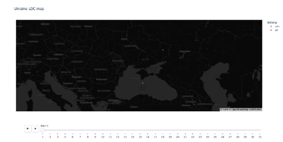

## Wolrd Events Analysis April 2022

This page illustrates a set of analysis as well as visualizations of the current world events happening in April 2022, specifically focusing on analyzing events in Ukraine. 

### Introduction

It is war time in Ukraine, the internet is down and there is not enough proper access to the news sources. Fortunately, a foreign intelligence agency was able to provide [screenshots](https://drive.google.com/file/d/1XhV7EUPRAKlzKHYpjR_LN1W3IjP8l-5U/view) from three news sources CNN, Fox, and Alijazeera. Each screenshot contains all the news from a single day from March 2022, sorted chronologically and stacked on top of each other. It is important to be able to extract the data from these images and to analyze the events as they unfold day by day. 

Any discovery would be attributed to understanding events happening in Ukraine. 

---
### Data processing

Technologies such as Optical Character Recognition (OCR), Named Entity Recognition (NER), GeoParsing and some visualization are ultilized to analyze the given data.

1. Firstly, the OCR tool Tesseract was used to extract text out of the given screenshots.
2. Secondly, the NER tool SpaCy was used to detect and extra the following entities out of OCR texts:
  - PERSON: People, including fictional.
  - NORP: Nationalities or religious or political groups.
  - FAC: Buildings, airports, highways, bridges, etc.
  - ORG: Companies, agencies, institutions, etc.
  - GPE: Countries, cities, states.
  - LOC: Non-GPE locations, mountain ranges, bodies of water.
  - PRODUCT: Objects, vehicles, foods, etc. (Not services.)
  - EVENT: Named hurricanes, battles, wars, sports events, etc.
  - DATE: Absolute or relative dates or periods.
  - TIME: Times smaller than a day.
4. Finally, Python GeoPy was used for geoparsing GPE and LOC entities to illustrate the frequency of these entities as they appear in the news day-by-day.

---
### Findings
#### Distributions of the entities pulled from spaCy

"PERSON" entity from all news source**s

 
  For the “PERSON” entity, we recognize that the top 20 most mentioned are Vladimir Putin, Joe Biden, Volodymyr Zelensky, Olden, Kherson, John Kirby, Kyiv,   Antony Blinken, Kharkiv, Sullivan, and Boris Johnson. Notice that the total number does not equal to 20, and this is because of similar repeated words,     such as Biden and Joe Biden. What interests us is that even though the event revolves around Ukraine and Russia, the second most mentioned person is Joe    Biden, which shows the significance of the US in politics and the news preference.
  
     

#### GeoParsing with LOC and GPE entities 

We use Mapbox for plotting a dynamic graph where the user can change its date and zoom in for details. We created two different visualizations and used LOC, GPE data separately. By separating LOC and GPE data, we can have a better understanding of urban areas and non-urban areas. 

LOC entity

 
  LOC data focused on non-urban regions. These regions were probably high active border regions and news expose of the battle frontline. According to our visualization, CNN was highly focusing on the black sea and eastern Ukraine. It makes perfect sense since Russia began its invasion at the end of February. Black Sea and eastern Ukraine(regions near Russia) were where the war began. Then, situations started to shift towards the mainland/central regions of Ukraine. Kyiv (the capital), northern Ukraine regions and some western regions all appeared on the map at one time. It was also the same time when Russia declared a total war on Ukraine. While we moved towards the end of March, the LOC data seemed to be contained in regions around Kyiv. In fact, Russia did not achieve any further invasion ever since they arrived in Kyiv. The war became chaotic and difficult for Russia to continue their march. 
 
   
  
  [LOC Mapbox](LOC_pic.html)
  

      
  
  

GPE entity

 
  blah blah   
   
   
  
  [GPE Mapbox](gpe.html)
  

      
  
  

---
### Contributors
Team DHKMWY - Duyen Nguyen, Harvey Fu, Kaiyin Chan, My Ta, Weixing Nie, and Yue Zeng.
