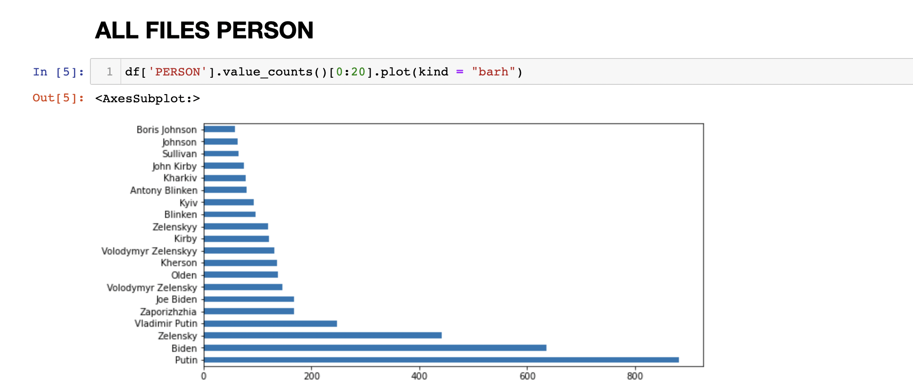

# Wolrd Events Analysis April 2022

This page illustrates a set of analysis as well as visualizations of the current world events happening in April 2022, specifically focusing on analyzing events in Ukraine. 

### Introduction

It is war time in Ukraine, the internet is down and there is not enough proper access to the news sources. Fortunately, a foreign intelligence agency was able to provide [screenshots](https://drive.google.com/file/d/1XhV7EUPRAKlzKHYpjR_LN1W3IjP8l-5U/view) from three news sources CNN, Fox, and Alijazeera. Each screenshot contains all the news from a single day from March 2022, sorted chronologically and stacked on top of each other. It is important to be able to extract the data from these images and to analyze the events as they unfold day by day. 

Any discovery would be attributed to understanding events happening in Ukraine. 

---
### Data processing

Technologies such as Optical Character Recognition (OCR), Named Entity Recognition (NER), GeoParsing and some visualization are ultilized to analyze the given data.

1. Firstly, the OCR tool Tesseract was used to extract text out of the given screenshots.
2. Secondly, the NER tool SpaCy was used to detect and extra the following entities out of OCR texts:
  - PERSON: People, including fictional.
  - NORP: Nationalities or religious or political groups.
  - FAC: Buildings, airports, highways, bridges, etc.
  - ORG: Companies, agencies, institutions, etc.
  - GPE: Countries, cities, states.
  - LOC: Non-GPE locations, mountain ranges, bodies of water.
  - PRODUCT: Objects, vehicles, foods, etc. (Not services.)
  - EVENT: Named hurricanes, battles, wars, sports events, etc.
  - DATE: Absolute or relative dates or periods.
  - TIME: Times smaller than a day.
4. Finally, Python GeoPy was used for geoparsing GPE and LOC entities to illustrate the frequency of these entities as they appear in the news day-by-day.

---
### Distributions of the entities pulled from spaCy from all news sources
  
  

      
  
 
  
  **“PERSON” entity:** we recognize that the top 20 most mentioned are Vladimir Putin, Joe Biden, Volodymyr Zelensky, Olden, Kherson, John Kirby, Kyiv, Antony Blinken, Kharkiv, Sullivan, and Boris Johnson. Notice that the total number does not equal to 20, and this is because of similar repeated words, such as Biden and Joe Biden. What interests us is that even though the event revolves around Ukraine and Russia, the second most mentioned person is Joe Biden, which shows the significance of the US in politics and the news preference.
  
  

      
  
 
  
  **“ORG” entity:** the top 20 distribution is divided into 3 categories: news source (CNN, Fox News, Al Jazeera), buildings (The White House, Kremlin, Pentagon), and institutions (NATO, EU, UN). GMT is ranked 2nd in the distribution, which really surprises us as GMT is the mean solar time. GMT should not be in the “ORG” entity, in our opinion, so this notion is beyond our expectations. 

  

      
  
 
  
  **“NORP” entity:** the majority of the distribution list revolves around Ukrainian and Russian. Russian are mentioned 3 times more frequent than Ukrainian, which might suggest the news’ preference and content. Other nationalities mentioned are European and Chinese. Two odd names appeared are Republican and Western, which do not clearly indicate the nationality. 

  

      
  
  
  
  **“LOC” entity:** the results are not as we anticipated. In the distribution list, we see many continent names with the addition to some of the seas and rivers, most of them are within the targeted areas. However, there are some peculiar results, such as “West”, “Mars”, “Zelenskyy”, and “Allies”. Our first guess is that these results were more like outliers, but “West” is ranked 2nd in the distribution. After seeing this result, we think the code will produce better results if we add bigrams and trigrams.

  

      
  
   
  
  **“GPE” entity:** the results are as expected. The top countries in the list are Ukraine, Russia, and the US, along with cities such as Moscow, Kyiv, and Chernobyl. If the distribution is a bit off in the “NORP” entity, the one in the “GPE” appears much more balanced as Russia and Ukraine are mentioned quite equally. 

  Overall, the results for distribution throughout all newsource are within our anticipation, with minimal outlier results. The distribution allows us to see how the content is distributed and whether some phrases are more preferred than others. 

### GeoParsing with LOC and GPE entities 

We use Mapbox for plotting a dynamic graph where the user can change its date and zoom in for details. We created two different visualizations and used LOC, GPE data separately. By separating LOC and GPE data, we can have a better understanding of urban areas and non-urban areas. 

**LOC entity** focused on non-urban regions. These regions were probably high active border regions and news expose of the battle frontline. According to our visualization, CNN was highly focusing on the black sea and eastern Ukraine. It makes perfect sense since Russia began its invasion at the end of February. Black Sea and eastern Ukraine(regions near Russia) were where the war began. Then, situations started to shift towards the mainland/central regions of Ukraine. Kyiv (the capital), northern Ukraine regions and some western regions all appeared on the map at one time. It was also the same time when Russia declared a total war on Ukraine. While we moved towards the end of March, the LOC data seemed to be contained in regions around Kyiv. In fact, Russia did not achieve any further invasion ever since they arrived in Kyiv. The war became chaotic and difficult for Russia to continue their march. The detail

[LOC Mapbox](LOC_pic.html)

  

      
  
  

**GPE entity** data points are concentrated in Europe. The reason for that could partly be that the density of countries is high in Europe, while Russia, which also had high occurrences in the dataset, is represented by only a dot on the map. On the other hand, as Russia declared a war on Ukraine, it is intuitive that the media focuses on European countries, especially those in NATO. Most of the data points are capitals or large cities.
  
[GPE Mapbox](gpe.html)
  
  

      
  
  

---
### Contributors
Team DHKMWY - Duyen Nguyen, Harvey Fu, Kaiyin Chan, My Ta, Weixing Nie, and Yue Zeng.
